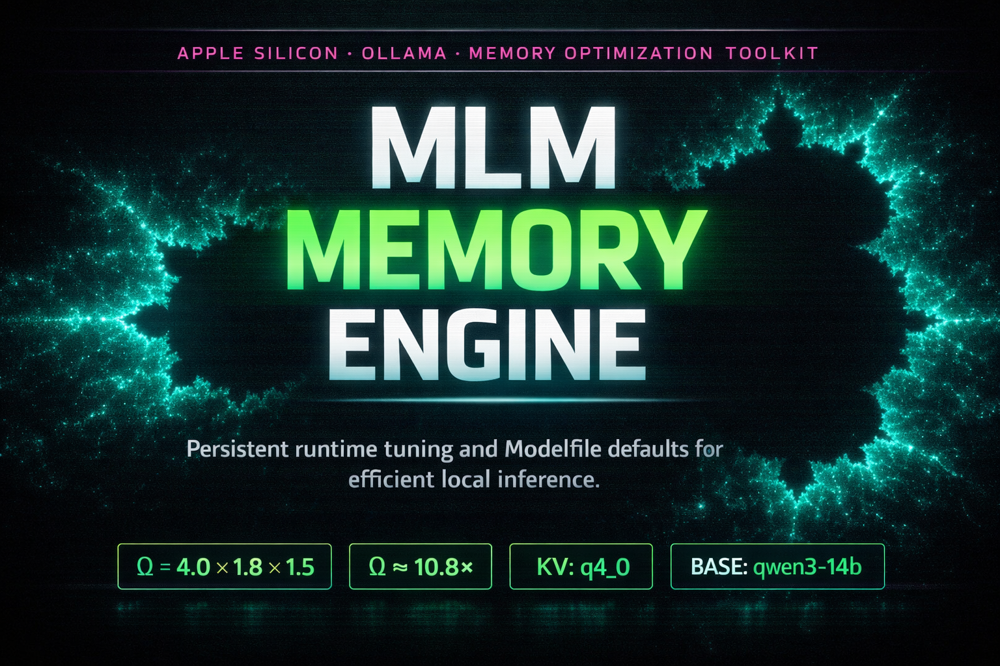

<p align="center">
  
</p>

<p align="center">
  
  
  
</p>

# ∞ MLM-MEMORY ∞

`ACID // PLASMA // VOID`

A functional Apple Silicon memory-optimization protocol for Ollama.
Primary assets:

- `mlm-memory` (runnable program)
- `mlm-memory.html` (themed interface + embedded script view)
- `sync-docs` (injects README.md + mlm-memory into mlm-memory.html)

## OMEGA MODEL

```text
OMEGA = KV_quant x FlashAttn x VMCompress
      = 4.0 x 1.8 x 1.5
      = 10.8x
```

## WHAT THE PROGRAM CHANGES

### PHASE I // DETECTION + PREP
- Detects architecture, Apple Silicon chip label, and logical CPU count
- Computes dynamic thread target: `num_thread = logicalcpu - 2` (minimum `1`)
- Locates Ollama binary (`ollama`, `/opt/homebrew/bin/ollama`, `/usr/local/bin/ollama`)

### PHASE II // OLLAMA ENV RECONFIGURATION
Sets and persists:

- `OLLAMA_FLASH_ATTENTION=1`
- `OLLAMA_KV_CACHE_TYPE=q4_0`
- `OLLAMA_MAX_LOADED_MODELS=1`
- `OLLAMA_KEEP_ALIVE=0`
- `OLLAMA_NUM_PARALLEL=1`

Writes those values into:

- `launchctl` environment
- `~/.zshrc`
- `~/.bash_profile` (if present)

### PHASE III // MEMORY PRESSURE TUNING (sudo)
Attempts:

- `sudo sysctl -w vm.compressor_mode=4`
- `sudo sysctl -w kern.memorystatus_vm_pressure_sends_note=1`
- `sudo pmset -a sleep 0`

If sudo is unavailable, the script continues with warnings.

### PHASE IV // MODELFILE GENERATION
Writes:

- `~/.ollama/mlm-memory_modelfiles/optimized.Modelfile`

Default base model is now built in:

- `FROM richardyoung/qwen3-14b-abliterated:latest`

Generated runtime parameters:

- `PARAMETER num_ctx 2048`
- `PARAMETER num_batch 256`
- `PARAMETER num_gpu 99`
- `PARAMETER num_thread <auto-detected>`

Note: deprecated `mirostat*` parameters were removed from the generated template.

### PHASE V // AUTOSTART DISABLED
Ensures Ollama does not auto-relaunch by:

- unloading `~/Library/LaunchAgents/com.ollama.mlm-memory.plist` (if present)
- disabling `gui/$(id -u)/com.ollama.mlm-memory`
- removing `~/Library/LaunchAgents/com.ollama.mlm-memory.plist`

Run Ollama manually when needed (`ollama serve` or `ollama run ...`).

### PHASE VI // PROOF OUTPUT
Prints detected RAM, estimated effective headroom (`RAM * 10`), and next-step model build commands.

## QUICK DETONATION

```bash
cd /path/to/mlm
chmod +x ./mlm-memory
./mlm-memory
```

## DEFAULT MODEL BUILD (MLM VARIANT)

```bash
ollama create richardyoung/qwen3-14b-abliterated-mlm:latest -f ~/.ollama/mlm-memory_modelfiles/optimized.Modelfile
ollama run richardyoung/qwen3-14b-abliterated-mlm:latest
```

## ARTIFACTS CREATED

- `~/.ollama/mlm-memory_modelfiles/optimized.Modelfile`

## VALIDATION

```bash
bash -n ./mlm-memory
launchctl print-disabled gui/$(id -u) | grep com.ollama.mlm-memory || true
```

## ROLLBACK CORE

```bash
launchctl unload ~/Library/LaunchAgents/com.ollama.mlm-memory.plist
rm ~/Library/LaunchAgents/com.ollama.mlm-memory.plist

grep -v "#MLM" ~/.zshrc > /tmp/zrc_tmp && mv /tmp/zrc_tmp ~/.zshrc
[[ -f ~/.bash_profile ]] && grep -v "#MLM" ~/.bash_profile > /tmp/bp_tmp && mv /tmp/bp_tmp ~/.bash_profile

sudo pmset -a sleep 1
```
